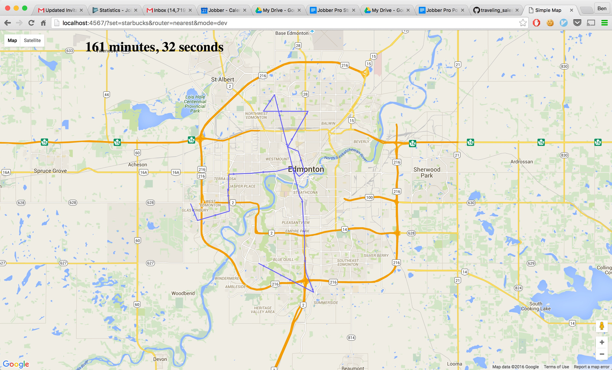

# The Traveling Salesman
This is a sandbox app to experiment around with solutions to the traveling salesman problem.



## Datasets
There are two datasets, subway, and starbucks, which are randomly selected 30 locations out of all locations for the two franchises in Edmonton.  The included "dev" sets should be used for development, but a *different* random sample will be used to benchmark the solutions.  Don't overly optimize for the specific dataset as the test will be different!

## Scoring
Teams will develop their own "router", which will be run against the two benchmark datasets (which are not included in the repo).  Their total drive times for starbucks and subway will be totaled, and that will be their score.  The lowest score wins!

Requests must run within 30 seconds.  If it can be shown to run within 30 seconds on the developers computer, solutions that take slightly longer on the judges machine will still be accepted. (i.e. it must run within 30 seconds on your development laptop)

`NOTE: It is assumed that you will act in good faith and provide your own solution, not an algorithm found through Google.`

## Submission
Your submissions should be submitted in the form of a PR with your branch.  This will allow quick and easy checking that the only modification is the addition of your router.

## Installation
```
git clone git@github.com:GetJobber/traveling_salesman.git
cd traveling_salesman
bundle install
```

## Running
```
ruby server.rb
```

## URL Params
```
http://localhost:4568?set=<subway|starbucks>&router=<naive|latitude|nearest>
```

`set` - Whether you want to route against subway or starbucks. Defaults to subway.
`router` - Which router you want to see the results for. Defaults to naive.

## Writing a router
The only file you need to interact with is your own router.  Place a file for the router at `routers/<your router name>_router.rb`  It will automagically be loaded when you select it through the URL param for the router.  The class must be the captalized version of the file name (e.g. nearest_router.rb and NearestRouter)

```
class LatitudeRouter < BaseRouter
  def route
    @routed_locations = @locations.sort_by(&:latitude)
  end
end
```

The router must inherit from the BaseRouter, and the only API you need to modify is the `route` method.  It gets the locations from the set from the @locations instance variable, and should set its sorted order of those locations on the @routed_locations instance variable.  Everything else is automagically handled for you.

There are three example routers you can look at for inspiration
- `NaiveRouter` - this just sets the routed locations to the locations.
- `LatitudeRouter` - this sorts the locations from north to south
- `NearestRouter` - the most optimized example router.  Sorts by sequentially going to the next nearest location.
